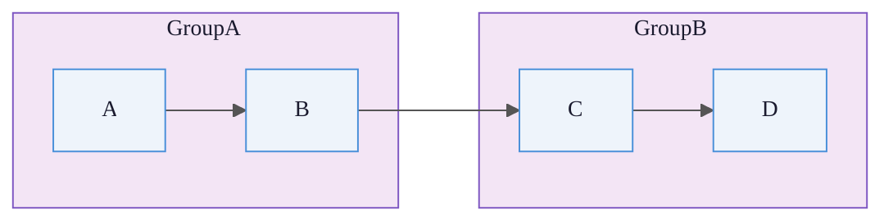

# Engine Style Templates

Use these as mandatory scaffolds. The model should preserve the style header and then fill in the diagram body around it.

## Cross-Engine Rules

Apply these to every diagram unless the user explicitly wants a different visual language:

- Use `#FAFAFA` as the canvas background, never pure white.
- Use Arial or Helvetica, minimum 13px or 13pt.
- Use at most 4 distinct fill colors per diagram.
- Use `#08427B` for person or user roles.
- Use `#1168BD` for services or app containers.
- Use `#FFF3E0` for data stores.
- Use white text on dark fills and `#1A1A2E` on light fills.
- Prefer darker arrows and labels than the node fills.

## PlantUML

Place the `<style>` block immediately after `@startuml` and before any elements.


For structure or runtime diagrams, switch individual edges to `-right->`, `-down->`, or `-left->` if the layout starts looping.

## C4-PlantUML

Use `UpdateElementStyle()` as the reliable default. If you choose to use `!theme`, place it before `!include`.

```plantuml
@startuml
!include https://raw.githubusercontent.com/plantuml-stdlib/C4-PlantUML/master/C4_Container.puml

LAYOUT_LEFT_RIGHT()

UpdateElementStyle("person", $bgColor="#08427B", $fontColor="#FFFFFF", $borderColor="#073B6F")
UpdateElementStyle("external_person", $bgColor="#6C7A89", $fontColor="#FFFFFF", $borderColor="#5A6773")
UpdateElementStyle("system", $bgColor="#1168BD", $fontColor="#FFFFFF", $borderColor="#3C7FC0")
UpdateElementStyle("external_system", $bgColor="#8E8E93", $fontColor="#FFFFFF", $borderColor="#7D7D82")
UpdateElementStyle("container", $bgColor="#438DD5", $fontColor="#FFFFFF", $borderColor="#3C7FC0")
UpdateElementStyle("database", $bgColor="#FFF3E0", $fontColor="#1A1A2E", $borderColor="#F5A623")
UpdateBoundaryStyle($bgColor="#FAFAFA", $fontColor="#1A1A2E", $borderColor="#B8B8B8")
UpdateRelStyle($lineColor="#666666", $textColor="#333333")
...
SHOW_LEGEND()
@enduml
```

Optional:

```plantuml
!theme C4_united from https://raw.githubusercontent.com/plantuml-stdlib/C4-PlantUML/master/themes
```

Only use the remote theme line when the renderer is known to support it cleanly.

## Graphviz

Always begin with `graph`, `node`, and `edge` defaults.

```dot
digraph G {
  graph [
    bgcolor="#FAFAFA",
    fontname="Helvetica",
    fontsize=13,
    pad=0.5,
    rankdir=LR,
    ranksep=1.2,
    nodesep=0.8,
    splines=ortho,
    overlap=false,
    remincross=true
  ]

  node [
    shape=box,
    style="filled,rounded",
    fillcolor="#EEF4FB",
    color="#4A90D9",
    fontname="Helvetica",
    fontsize=12,
    fontcolor="#1A1A2E",
    margin="0.18,0.10"
  ]

  edge [
    color="#555555",
    fontname="Helvetica",
    fontsize=10,
    fontcolor="#333333",
    arrowsize=0.8
  ]

  ...
}
```

Prefer cluster-level color blocks over one-off per-node colors.
Use `rank=same` blocks when peers belong on the same layer.

## Mermaid

Put the init block on the first line. Use `theme: 'base'`.



Always define semantic `classDef` groups and assign them.
For medium or large flowcharts, use `subgraph` blocks before writing cross-group edges.

## ERD Engine In This Skill

This skill's `erd` engine is not Mermaid ERD. It is a separate Kroki ERD renderer with much weaker theming hooks.

Use these practical defaults instead:

- Prefer `PascalCase` entity names for cleaner labels.
- Keep attribute labels short and consistent.
- Limit each entity to the fields needed for the diagram's point.
- If you need strong visual theming or striped rows, prefer Mermaid ERD only when the user explicitly requests Mermaid and the repo conventions allow it.
